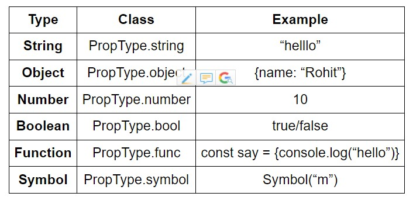
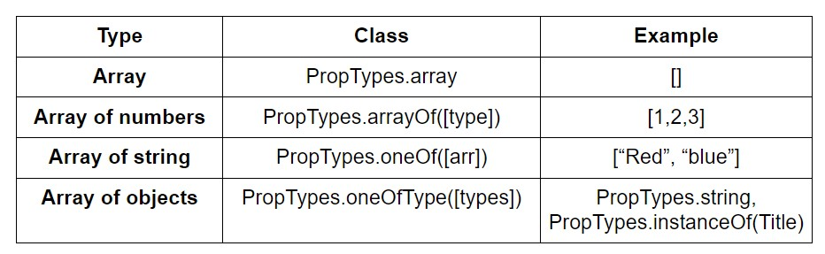
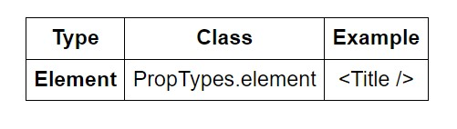

# 0x02-react_props

## 5- Props

- Props stands for properties
- Props are like Html attributes (name="value")
- they can pass data from a parent components to is child components

```js
App // parent
<Header title="hello world"> // child

// Header component
// we can access title inside header Component
<header>{props.title}</header>
```

- It' like

```js
props = {
    title:"hello world",
    age: 40
}
App // parent
<Header title="hello world" age="40"> // child

// Header component
// we can access title inside header Component
<header>{props.title} {props.age}</header>
```

- components can't change the props they're read-only.

## [Keys](https://legacy.reactjs.org/docs/lists-and-keys.html#keys)

when we make list in React we shouls always use the Key keywords, to identify each list item, and it will also help us to manipulate list items.

```js
function NumberList(props) {
  const numbers = props.numbers;
  return (
    <ul>
      {numbers.map((number) => (
        <ListItem key={number.toString()} value={number} />
      ))}
    </ul>
  );
}
```

## [Fragment](https://react.dev/reference/react/Fragment)

## [Test]()

To develop your tests faster, you can watch them. The test suite will run for every change you make:

- Add the following script to task_1/package.json

````js
"test-watch": "jest --watch"```
````

- Run your suite using

```js
npm run test-watch
```

#### shallow

- import { shallow } from "enzyme";
  it's a function provided by enzyme that allows us to render a component one level deep and ensures that it doesn't render it cild components.
  which means it isolate components you're testing from it's children.

````js
const wrapper = shallow(<MyComponent />);```
````

## [PropTypes](https://www.freecodecamp.org/news/how-to-use-proptypes-in-react/)

#### What are PropTypes?

ropTypes are simply a mechanism that ensures that the passed value is of the correct datatype. This makes sure that we don’t receive an error at the very end of our app by the console which might not be easy to deal with.

#### How to use PropTypes

- npm install prop-types --save
  We can use PropTypes to validate any data we are receiving from props

we should import PropTypes in our app

```js
import PropTypes from "prop-types";
function Test(props) {
  // ...Code
}

Test.propTypes = {
  // key: value
  // key: value
  //// key is the name of the prop and
  // value is the PropType
};

export default Test;
```

#### Basic Types of PropTypes

ist of all data types that are considered primitive or the basic ones with their classes that we can use to check props.


- EX:

```js
Test.propTypes = {
  name: PropTypes.string,
  age: PropTypes.number,
  address: PropTypes.object,
  friends: PropTypes.array,
};
```

#### Collective Type



```js
Test.propTypes = {
  counts: PropTypes.array,
  users: PropTypes.arrayOf(PropTypes.object),
  alarmColor: PropTypes.oneOf(["red", "blue"]),
  description: PropTypes.oneOfType([
    PropTypes.string,
    PropTypes.instanceOf(Title),
  ]),
};
```

#### Object Types


```js
Count.propTypes = {
  basicObject: PropTypes.object,
  numbers: PropTypes.objectOf(PropTypes.numbers),
  messages: PropTypes.instanceOf(Message),
  contactList: PropTypes.shape({
    name: PropTypes.string,
    phone: PropTypes.string,
  }),
};
```

#### How to Check for a React Component

If you want to just check to see if a prop is a React component, you can use PropTypes.element. This is useful for ensuring that a component only ever has one child component.



```js
Test.propTypes = {
  displayEle: PropTypes.element,
};
```

#### How to Check for a React Component Name

Finally, we can check to see if the prop is the name of a React component by using PropTypes.elementType.

```js
Component.propTypes = {
  as: PropTypes.elementType,
};
```

```js
<AnotherComponent as={Component} />
```

#### Default PropTypes

Sometimes, we want to be able to set a default value for a prop. For instance, our parent component might not require a title to be passed. But we still want a title to be rendered.

In cases like this, we can set a default value for our title which will automatically be rendered if the title has not been passed as a prop from our parent component.

```js
NotificationItem.defaultProps = {
  type: "default",
  html: "",
  value: "",
};
```
